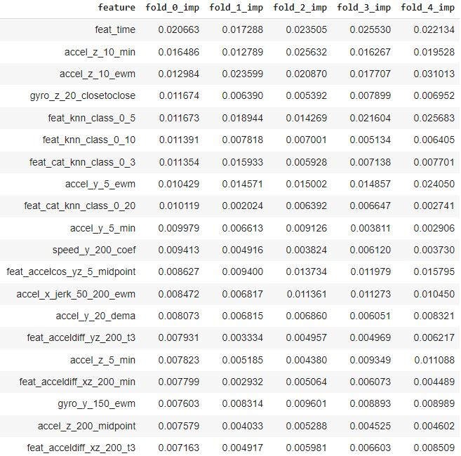

<!-- PROJECT LOGO -->
<br />
<div align="center">
  
  <h3 align="center"> Device Operating Region Classification Match </h3>

  <p align="center">
    Code and solution repository containing the functionalities for the 2022 Device Operating Challenge 
    <br />
    <a href="https://www.topcoder.com/challenges/2ae3b08a-aabc-4345-87bd-7edfff837e8c?tab=details"><strong>Visit competition site »</strong></a>
  </p>
</div>


<!-- TABLE OF CONTENTS -->
## Table of contents
  <ol>
    <li> <a href="#context-of-the-challenge">Context of the challenge</a> </li>
    <li><a href="#data-overview">Data overview</a></li>
    <li><a href="#multiclass-label-analysis">Multiclass label analysis</a></li>
    <li><a href="#solution-approach">Solution approach</a></li>
    <li><a href="#results-obtained">Results obtained</a></li>
    <li><a href="#live-time-runtime">Live-time runtime</a></li>
    <li><a href="#repository-structure">Repository structure</a></li>
    <li><a href="#usage">Usage</a></li>
     <ul>
        <li><a href="#prerequisites">Prerequisites</a></li>
        <li><a href="#execution">Execution</a></li>
        <li><a href="#timing">Timing</a></li>
      </ul>
    <li><a href="#potential-next-steps">Potential next steps</a></li>
    <li><a href="#acknowledgments">Acknowledgments</a></li>
  </ol>


<!-- CONTEXT -->
## Context of the challenge

<div align="justify">

Sensors are a cornerstone of modern-day technology. They enable use cases such as position tracking, autonomous driving and motion categorization and although they mostly go unnoticed by the end-user they form a crucial part of our day-to-day interactions and social construct. In this competition an annonymous client partnered with topcoder to develop a methodology to automatically classify gyroscope and accelerometer time series data into 20 different classes. While the particular device and application has been kept secret during the course of the challenge, this is a generic problem the solution to which can be generalized to any type of sensor recordings. There is an extensive body of literature on multiclass time series classification applied to this type of data, refer to [ML approach to next position prediciton](https://vtechworks.lib.vt.edu/bitstream/handle/10919/82329/Barrows_BA_T_2018.pdf?sequence=1&isAllowed=y) and [Exercise motion recognition](http://article.nadiapub.com/IJCA/vol11_no2/8.pdf) for further detail. 

The contest will be evaluated based on the macro-average AUC performance in a held-out test-set where participants will be rank-ordered based on the goodness of fit of their solutions. While accuracy accross classes is our main goal, this is not a theoretical exercise only, there is a hard restriction on the complexity of our solution limiting the inference time to 1 second / 26 timesteps since the goal is to productize the developed solution in a mobile device. 

This challenge is specially interesting for the following reasons which will be touched upon in the upcoming sections:
- **Applicability**: This is not a mere theoretical exercise and the competition scope is to develop a functioning product
- **Evaluation metric**: While the classes are imbalanced, the evaluation criteria to rank-order contestants is based on the average of independent AUCs for each class which makes the model training process non-orthodox
- **Modularity of the data**: Working with degrees/second makes the data not have sorted magnitude relevance, i.e. 359 and 1 are closer than 5 and 10 in degrees. This adds an additional layer of complexity to the feature building process for our machine learning model.
- **Cost of errors**: While not covered directly in the competition, the rules specify that a confusion matrix should be provided yielding that the cost of errors is not the same for all types of errors

<!-- DATA OVERVIEW -->
## Data overview

<div align="justify">

As mentioned above, the raw data provided in this challenge consists of 6 time series (XYZ axis for gyroscope and accelerometer recordings respectively) together with a label indicating in which class the device is at each timestep. The head of the raw data can be observed below:

<p align="center">
  
</p>


It is interesting to note the normalization process required to make sense of the above data and feed it to a machine learning model. Gyro data, for instance, represents changes in rotation in degrees/second only after normalizing by a factor of 26 and 4.48, to retrieve the position we need to take the cumulative sum from the beginning of the session and even then we will need to account for modularity since 359 degrees in axis Y is very close to 1 degree in axis Y. 

A sample session with its acceleration time series and classes is plotted below, as one can note, there is a temporal dependency of the classses within a session and changes in class are seldom within sessions.

<p align="center">

</p>

<!-- MULTICLASS LABEL ANALYSIS -->
## Multiclass label analysis

<div align="justify">

There are 20 classes indexed from 0 to 19 with the following base counts in the training data:

<p align="center">

</p>

As anticipated in the previous subsection, there is a significant time-dependency of the classes. In the table below we observe the relation between the decile of the timestamp and the class counts suggesting that some classes only appear at certain timesteps within a given session, e.g. class 0:

<p align="center">

</p>

The changes from one class to another within a given session (or independent time series) are seldom in the sense that the time series mostly stays in the same class. The transition matrix from one class to another from the train set can be observed below:

<p align="center">

</p>

An additional analysis that helps contextualize the nature of our target variable is the unique classes within a particular session. Below each row represents the sorted unique classes that appear in each session or independent time series in which our device is being recorded:

<p align="center">

</p>

This suggests that it might be valuable to model the classes as a series of events, i.e. finding relations between the class changes on top of the relations between the explanatory variables (acceleration and gyro) and the current class.

<!-- APPROACH -->
## Solution approach

In order to solve this challenge a multiclass classifier trained at the timestep unit of analysis has been built. The process to reach the final model and data pipeline consists of 5 steps:

1. **Feature extraction**: Created >4000 features consisting of aggreggations and lookback periods that potentially explain class changes based on past information. These features go from basic statistics (mean acceleration Z in the last 50 observations) to fancier relations such as the change of sin position derived from the cumulative sum of gyro data. From this massive set of features a selection process has been performed to retain only 250 variables
2. **KNN model creation**: Using the most promising features (those that allow to separate the classes more clearly) we perform a 5-fold cross validation KNN feature extraction to predict the class
3. **Parameter search for a meta-model**: After having a large feature base consisting of past aggreggations and KNN features we execute a 5-fold parameter search to find the best parameters for a CatBoost multiclass classifier
4. **Meta-model training with 5-fold CV**: Having at hand the best performing set of parameters a meta-model is trained splitting in 5 folds by session all the training data points - the final test predictions will be the average of the model predictions of each fold model
5. **Error analysis and model understanding**: Finally, the model is understood through a process of error and feature analysis 

<!-- RESULTS -->
## Results obtained

To understand the model results we will study the goodness of fit by class and the feature contributions. In

<p align="center">
  
</p>


We can further understand where these errors are being made by looking at the multiclass confusion matrix portrayed below:

<p align="center">
  
</p>

As we can see comparing our hard predictions with the ground truths, there are some classes that the model finds particularly difficult to distinguish such as XXX and XXX. And as we can observe below, the features the model leverages the most are the following (expressed as share over 1 of the total feature contribution for each fold):

<p align="center">
  
</p>

Meaning that XXX and XXX

<!-- LIVE-TIME RUNTIME -->
## Live-time runtime

Abstracting ourselves from the model details discussed above, the goal of the solution is to have a containerized solution that can serve predictions in real-time. The process is detailed below:


1. Device collects data
2. Data is stored as in the test.csv format, i.e. 
3. 


<!-- REPOSITORY -->
## Repository structure

Having understood the methodological approach and live runtime, in this section we specify the contents of the solution repository. Below one can find a diagram of the directory structure.

```
DeviceOperatingClassifier
└───README.md
└───images
└───solution
│   │   solution.csv
└───code
│   │   data
│   │   model
│   │   src
│   │   Dockerfile
│   │   flags.txt
│   │   requirements.txt
│   │   test.sh
│   │   train.sh
```


<!-- USAGE -->
## Usage

XXX

### Prerequisites

XXX

### Execution

To train 

```python 
$ python -W ignore train.py <training_filename> <model_filename>
```

To test

```python 
$  python -W ignore test.py <testing_filename> <solution_filename> <model_filename>
```

### Timing

Testing the timing execution of the entire pipeline we observe the following KPIs which fall below the acceptance criteria specified by the competition:

- Training: ~3.5h of data processing to create the master table + ~2h of model training on a GPU
- Testing: Average of 0.85s/window of 26 instances in local machine with single CPU and 0.77s/window on a p3.8xlarge EC2 AWS instance

<!-- POTENTIAL NEXT STEPS -->
## Potential next steps

<!-- ACKNOWLEDGMENTS -->
## Acknowledgments

As a closing remark, I would like to place on record my deepest sense of gratitude towards topcoder and the client organization for hosting this competition. Their continuous support and encouragement have been invaluable to develop the final product described above.
  
</div>
